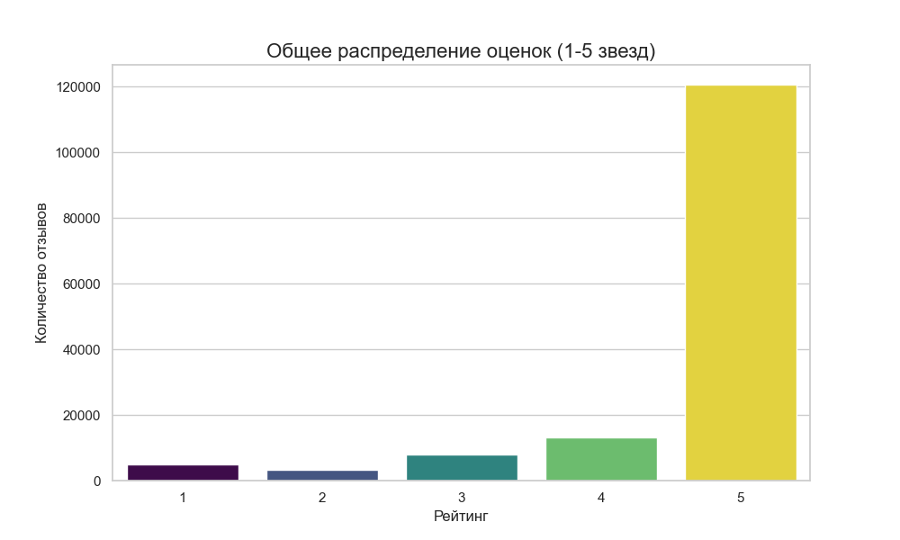
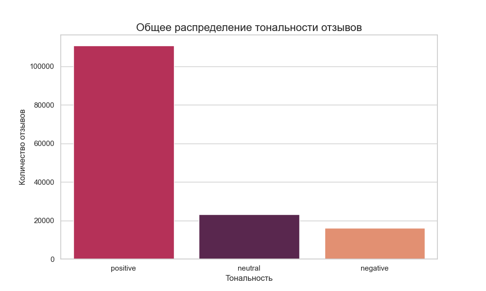

# 🛍️ Анализ отзывов на товары Wildberries с использованием SQL и NLP

Этот проект представляет собой комплексную систему для сбора, хранения и анализа текстовых отзывов на товары с платформы Wildberries. Основная цель — извлечение ценных бизнес-инсайтов из неструктурированных текстовых данных с помощью современных СУБД и NLP-моделей.

## 🎯 Бизнес-задачи проекта

  * **Выявление популярных и проблемных товаров** на основе количества отзывов и их тональности.
  * **Понимание ключевых факторов удовлетворенности клиентов** путем анализа частотных слов и фраз.
  * **Автоматическая категоризация отзывов** по тональности (позитив, негатив, нейтральный).
  * **Обнаружение аномалий и потенциально фальшивых отзывов** для оценки качества данных.

-----

## 🛠️ Используемые технологии

  * **База данных:** PostgreSQL 17
  * **Контейнеризация:** Docker, Docker Compose
  * **Расширения PostgreSQL:**
      * `pgvector` для хранения и поиска векторных представлений (эмбеддингов).
      * `plpython3u` для интеграции NLP-моделей на Python напрямую в БД.
  * **NLP-модели:**
      * `blanchefort/rubert-base-cased-sentiment` для анализа тональности.
      * `paraphrase-multilingual-MiniLM-L12-v2` для создания эмбеддингов.
  * **Python и библиотеки:** Pandas, Psycopg2, Matplotlib, Seaborn, Transformers, Sentence-Transformers.

-----

## 🧱 Структура проекта  
  
wildberries_reviews_analysis/  
│  
├── .gitignore              # Указывает Git, какие файлы игнорировать (например, .env)  
├── docker-compose.yml      # Главный файл для запуска всего проекта одной командой  
├── README.md               # Описание проекта, выводы, графики и инструкция по запуску  
└── requirements.txt        # Список всех Python-библиотек для установки  
│  
├── config/  
│   └── .env.example        # Шаблон для .env  
│  
├── database/  
│   ├── Dockerfile            # Инструкция по сборке кастомного образа PostgreSQL с NLP-библиотеками  
│   ├── 01_tables.sql         # Создание таблиц, индексов и связей  
│   ├── 02_functions.sql      # Функции для NLP (анализ тональности, эмбеддинги)  
│   ├── 03_sample_data.sql    # Небольшой набор тестовых данных для проверки  
│   └── 04_optimization.sql   # Создание материализованных представлений для ускорения аналитики  
│  
├── python/  
│   └── data_loader.py        # Скрипт для очистки БД, загрузки данных из CSV и запуска их обработки  
│  
├── analysis/  
│   ├── basic_analysis.sql    # Набор готовых SQL-запросов для получения бизнес-инсайтов  
│   └── advanced_analysis.py  # Скрипт для сложной аналитики (поиск аномалий) и визуализации  
│  
└── img/  
    ├── ratings_distribution.png # Сохраненный график с распределением оценок  
    └── sentiment_distribution.png # Сохраненный график с распределением тональности  
  
-----

## 🚀 Быстрый старт

1.  **Клонируйте репозиторий:**

    ```bash
    git clone https://github.com/mrskbj/wildberries_reviews_analysis/
    cd wildberries_reviews_analysis
    ```

2.  **Настройте окружение:**
    Скопируйте файл `config/.env.example` в `config/.env` и при необходимости измените в нем данные для подключения к БД.

3.  **Подготовьте данные:**
    Поместите ваш CSV-файл с данными (например, `prepared_data.csv`) в папку `data/`.

4.  **Запустите проект:**
    Эта команда соберет кастомный образ PostgreSQL со всеми библиотеками и запустит все контейнеры в фоновом режиме.

    ```bash
    docker-compose up --build -d
    ```

5.  **Загрузите и обработайте данные:**
    После запуска контейнеров выполните Python-скрипт для загрузки данных в базу и запуска их NLP-обработки.

    ```bash
    # Активируйте ваше локальное виртуальное окружение, если нужно
    # python python/data_loader.py
    ```

Проект запущен\! База данных доступна по порту, указанному в `.env` (например, `5433`), а Adminer — по адресу `http://localhost:8080`.

-----

## 📊 Ключевые выводы и результаты анализа

#### 1: Пользовательские оценки (рейтинги) сильно искажают реальную картину.

Анализ показал, что **80% отзывов имеют оценку "5 звезд"**, создавая иллюзию почти полной удовлетворенности. Однако NLP-анализ текста классифицировал как "позитивные" только **74% отзывов**. Было найдено **более 5300 аномалий**, где за высокой оценкой скрывались жалобы на размер, цвет или брак.

**Вывод:** Доверять только "звездочкам" нельзя. Анализ текста является критически важным для понимания реальных проблем клиентов.

### Визуализация выводов

Сравнение распределения оценок и реальной тональности текста наглядно показывает, что высокий рейтинг не всегда означает положительный опыт.




#### 2: "Размер" и "Качество" — главные факторы, определяющие опыт покупателя.

Эти два слова доминируют в топе самых частотных как в позитивных, так и в негативных отзывах. Это говорит о том, что для клиентов Wildberries успешный опыт покупки почти полностью зависит от соответствия товара размерной сетке и его качества.

#### 3: Обнаружены признаки накруток и некачественных данных.

Анализ выявил группы, где один и тот же длинный отзыв повторяется **более 30 раз**, что является сильным индикатором накрутки. Также распространены короткие, неинформативные ответы ("не подошел размер"), что говорит о необходимости дополнительной фильтрации данных при построении сложных моделей.

-----


## ❓ Ответы на возможные вопросы (FAQ)

**В: Почему обработка данных занимает много времени?**
О: Потому что NLP-модели на архитектуре Transformer (как те, что я использую в коде) требуют значительных вычислительных ресурсов. В текущей конфигурации вся обработка выполняется на CPU. Для кратного ускорения (в 10-50 раз) можно было бы задействовать GPU (видеокарту), но это требует более сложной настройки окружения. Если бы датасет был от миллиона строк и выше, то непременно бы задействовала видеокарту.

**В: Почему в результатах поиска похожих отзывов мы видим одинаковый текст?**
О: Потому что наш запрос правильно находит наиболее похожие по смыслу отзывы. Если несколько отзывов с разными ID имеют идентичный текст, они будут справедливо показаны как одинаково похожие. И это подтверждает наличие дубликатов в датасете.
